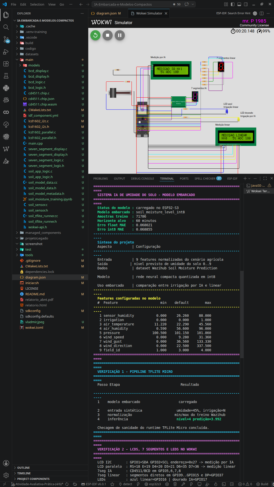
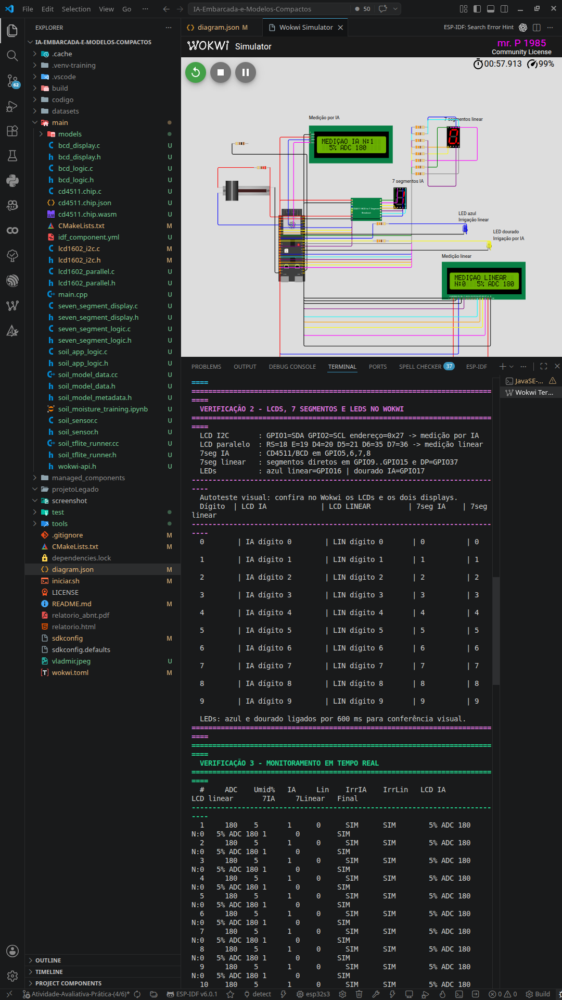
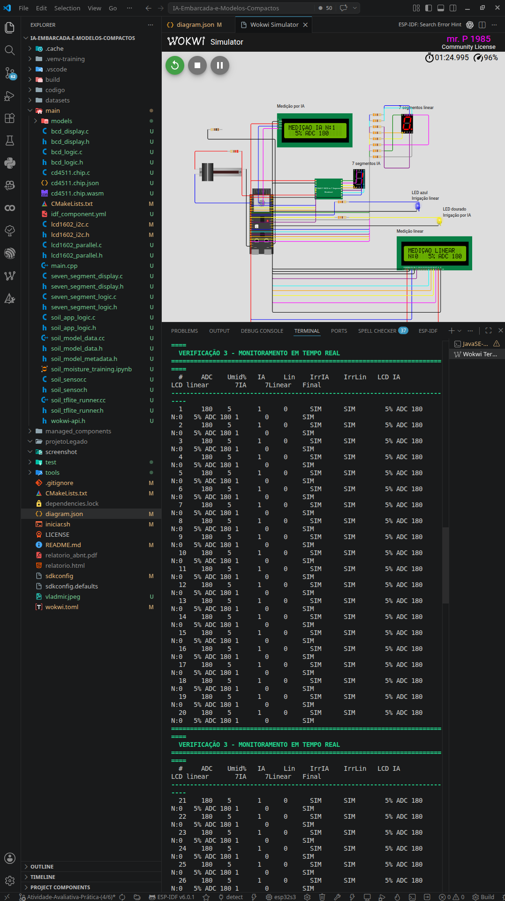
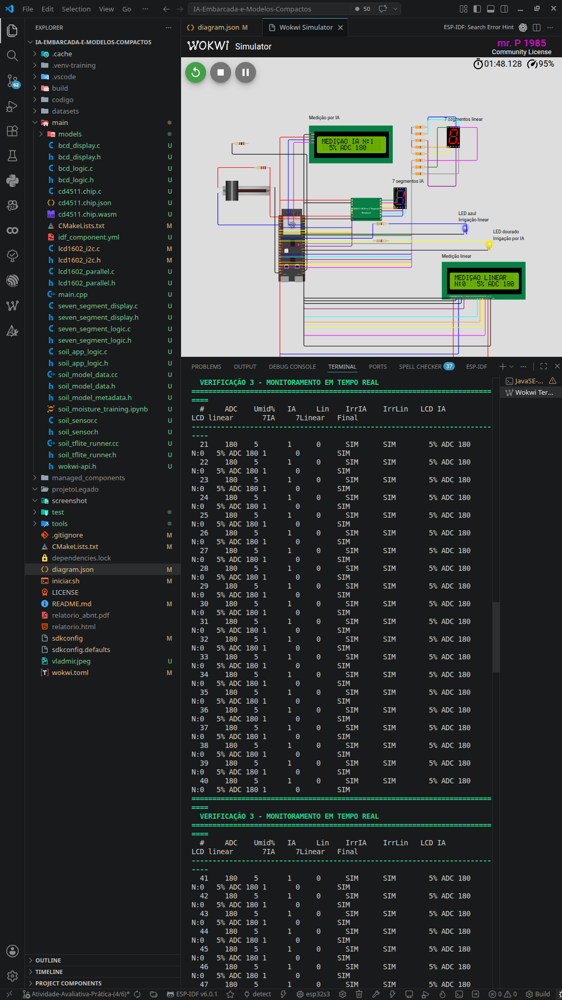
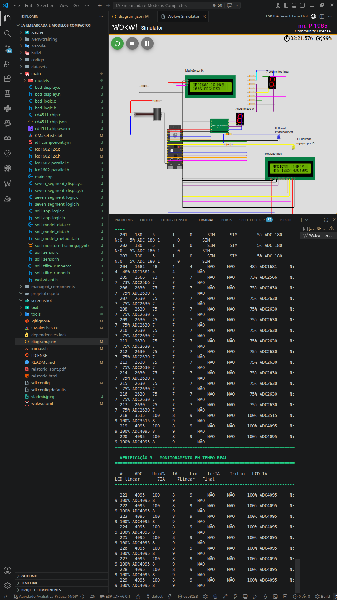

# IA Embarcada e Modelos Compactos

Projeto de IA embarcada convertido para ESP-IDF no ESP32-S3. A aplicação implementa um sistema de monitoramento de umidade do solo, inspirado no circuito legado em `projetoLegado/`, com dois LCD1602, saída BCD/CD4511, dois displays de 7 segmentos, LEDs indicadores de irrigação e inferência TensorFlow Lite Micro.

## O que faz

A aplicação lê um sensor analógico de umidade do solo, converte a leitura em porcentagem, monta as entradas do modelo e executa uma rede neural `int8` no ESP32-S3. O LCD I2C e o display via CD4511/BCD mostram a medição baseada em IA, enquanto o LCD paralelo e o segundo display de 7 segmentos mostram a medição linear de referência. Quando a irrigação é indicada pela medição linear, o LED azul pisca; quando é indicada pela medição de IA, o LED dourado pisca.

O modelo foi treinado com o dataset Wazihub Soil Moisture Prediction, usando dados de quatro campos agrícolas com umidade do solo, irrigação e clima em intervalos de 5 minutos. O alvo escolhido foi prever o nível de umidade do solo 60 minutos à frente.

Fluxo de treinamento e exportação do modelo:

1. carregar/baixar dataset
2. preparar dados de treino e validação
3. treinar uma rede Keras pequena
4. converter para TFLite float
5. quantizar para TFLite `int8`
6. avaliar float vs `int8`
7. gerar `main/soil_model_data.cc` para o firmware

## Componentes usados

- ESP32-S3 DevKitC-1
- sensor analógico de umidade do solo, simulado no Wokwi por um potenciômetro
- um LCD1602 I2C e um LCD1602 paralelo em modo 4 bits, como no esquema do legado
- CD4511 customizado para Wokwi, ligado a um display de 7 segmentos comum cátodo
- segundo display de 7 segmentos comum cátodo dirigido diretamente pelo ESP32-S3
- LED azul para irrigação acionada pela medição linear
- LED dourado para irrigação acionada pela medição de IA
- resistores `R1..R12`, mantendo `R1..R10` do legado e adicionando `R11/R12=330R` para os LEDs
- rótulos Wokwi no diagrama para diferenciar medição IA, medição linear e indicadores de irrigação

## Circuito

| Componente | Sinal | Pino no ESP32-S3 |
|:---|:---:|:---:|
| LCD1602 principal | SDA | GPIO 1 |
| LCD1602 principal | SCL | GPIO 2 |
| LCD1602 principal | VCC/GND | 5V/GND |
| LCD1602 paralelo | RS, E | GPIO 18, 19 |
| LCD1602 paralelo | D4, D5, D6, D7 | GPIO 20, 21, 35, 36 |
| LCD1602 paralelo | VDD/VSS, RW, A/K | 5V/GND, GND, 5V/GND |
| Sensor de umidade | SIG/ADC | GPIO 4 / ADC1 CH3 |
| Sensor de umidade | VCC | 3V3 via `R2=220R` |
| Sensor de umidade | GND | GND |
| CD4511 | entradas A, B, C, D | GPIO 5, 6, 7, 8 |
| CD4511 | VDD/VSS, LT, BL, LE | 5V/GND, 5V, 5V, GND |
| 7 segmentos via CD4511 | A, B, C, D, E, F, G | saídas SEG_A..SEG_G do CD4511 |
| 7 segmentos via CD4511 | COM | GND via `R1=100R` |
| 7 segmentos direto | A, B, C, D, E, F, G, DP | GPIO 9, 10, 11, 12, 13, 14, 15, 37 via `R3..R10=330R` |
| LED azul de irrigação linear | A | GPIO 16 via `R11=330R` |
| LED dourado de irrigação por IA | A | GPIO 17 via `R12=330R` |
| LEDs de irrigação | C | GND |

O CD4511 do `diagram.json` é um chip customizado compilado em `cd4511.chip.wasm` e registrado no `wokwi.toml`.

## Treinar novamente

O dataset já foi baixado em:

```bash
datasets/Wazihub_Soil_Moisture_Prediction
```

Para retreinar e regenerar o modelo embarcado:

```bash
/tmp/soil-tflite-venv/bin/python tools/train_soil_moisture_tflite.py --epochs 60
```

O script `tools/train_soil_moisture_tflite.py` é autossuficiente para os dados: se `datasets/Wazihub_Soil_Moisture_Prediction/Dataset/Train.csv` não existir, ele tenta baixar o dataset pelo GitHub com `git clone`; se isso falhar, baixa o ZIP do repositório, descompacta e continua o treino.

Se for rodar em outra máquina, instale as dependências Python em uma virtualenv:

```bash
python3.11 -m venv /tmp/soil-tflite-venv
/tmp/soil-tflite-venv/bin/python -m pip install -r tools/requirements-training.txt
/tmp/soil-tflite-venv/bin/python tools/train_soil_moisture_tflite.py --epochs 60
```

Arquivos gerados pelo treino:

- `main/models/soil_moisture_level_float.tflite`
- `main/models/soil_moisture_level_int8.tflite`
- `main/models/soil_moisture_saved_model/`
- `main/soil_model_data.cc`
- `main/soil_model_metadata.h`

## Rodar o notebook

O notebook [main/soil_moisture_training.ipynb](main/soil_moisture_training.ipynb) está configurado para rodar localmente no VS Code com o kernel:

```text
IA Embarcada Training (Python 3.11)
```

O ambiente fica em `.venv-training/`. Para recriá-lo em outra máquina:

```bash
/home/patrik/.local/bin/python3.11 -m venv .venv-training
.venv-training/bin/python -m pip install -r tools/requirements-training.txt
.venv-training/bin/python -m ipykernel install --user --name ia-embarcada-training --display-name "IA Embarcada Training (Python 3.11)"
```

Os modelos gerados pelo notebook são salvos em `main/models/notebook_outputs/`.

No Google Colab, o notebook também funciona de forma autônoma: se ele não encontrar a raiz do projeto, clona este repositório a partir do GitHub; se faltar o dataset, baixa o Wazihub antes de executar as etapas de análise, treino, conversão, quantização e avaliação.

## Como rodar

Precisa ter o ESP-IDF e o Wokwi Simulator instalados no VS Code.

```bash
./iniciar.sh
```

Ao rodar em outro computador, o `iniciar.sh` verifica antes da compilação se existem o dataset, os modelos `.tflite`, `main/soil_model_data.cc` e `main/soil_model_metadata.h`. Se algum deles estiver ausente, ele cria/usa `.venv-training`, instala as dependências de treino e executa `tools/train_soil_moisture_tflite.py` automaticamente. Para mudar a quantidade de épocas nesse treino automático, use `TRAIN_EPOCHS=20 ./iniciar.sh`.

O script compila o firmware. Para rodar a simulação dentro do VS Code, abra a paleta de comandos com `Ctrl+Shift+P` e execute `Wokwi: Start Simulator`.

No monitor serial deve aparecer algo assim:

```text
VERIFICAÇÃO 1 - PIPELINE TFLITE MICRO, ESTILO HELLO WORLD
VERIFICAÇÃO 2 - LCDS, 7 SEGMENTOS E LEDS NO WOKWI
VERIFICAÇÃO 3 - MONITORAMENTO EM TEMPO REAL
#     ADC    Umid%   IA     Lin    IrrIA    IrrLin   LCD IA           LCD linear       7IA     7Linear   Final
1     1578   45      4      4      NÃO      NÃO      45% ADC1578      N:4  45% ADC1578 4       4         NÃO
```

O primeiro bloco confirma pelo console o fluxo equivalente ao Hello World do TensorFlow Lite Micro: modelo carregado, entrada sintética, normalização e inferência. O segundo bloco executa um autoteste visual: os dois LCDs exibem mensagens de teste, os dois displays de 7 segmentos percorrem os dígitos `0..9` e os LEDs piscam para conferência no Wokwi. O terceiro bloco passa a mostrar a leitura em tempo real do sensor, a previsão por IA, a medição linear e o que deve aparecer em cada display.

## Capturas da execução











## Relatório e observações

O relatório completo, com tabelas comparativas e formatação detalhada, encontra-se em [`relatorio.html`](relatorio.html).

O projeto parte do pipeline clássico do TensorFlow Lite Micro — geração de dados, treinamento de uma rede compacta, conversão para TFLite, quantização pós-treinamento em `int8` e avaliação comparativa entre o modelo float e o modelo quantizado — e estende esse fluxo para um domínio real de monitoramento agrícola. O exemplo de referência (regressão senoidal) foi reproduzido integralmente, servindo como validação do caminho completo entre um modelo treinado em Python e o vetor de bytes que o firmware consome em tempo de execução.

Na transição para a aplicação própria, o sensor de entrada passou a ser um analógico de umidade do solo (simulado por potenciômetro no Wokwi, lido via ADC no GPIO 4) e o dataset foi substituído pelo Wazihub Soil Moisture Prediction, que contém 71.786 amostras de quatro campos agrícolas com nove variáveis ambientais registradas em intervalos de cinco minutos. O modelo foi retreinado com a mesma topologia `Dense(16) → Dense(16) → Dense(1)` para prever o nível de umidade do solo 60 minutos à frente, convertido para TFLite e quantizado em `int8`. O delta de MAE entre o modelo float (`0.068021`) e o modelo quantizado (`0.068855`) ficou abaixo de `0.001`, o que indica que a redução de 32 para 8 bits por peso preservou, de forma efetiva, a qualidade da regressão. A título de comparação, no exemplo senoidal de referência esse delta foi de `0.011` — provavelmente maior por conta do condicionamento numérico menos favorável dos dados sintéticos.

Do ponto de vista de código, o firmware foi estruturado de forma modular: o driver de sensor (`soil_sensor.c`), o runtime TFLite Micro (`soil_tflite_runner.cc`), a lógica de normalização e decisão (`soil_app_logic.c`) e os drivers de display (LCD I2C, LCD paralelo, BCD via CD4511, 7 segmentos direto) ficam em módulos separados com interfaces bem definidas. A normalização das nove features no firmware utiliza os mesmos vetores de mínimo e máximo gerados pelo script de treinamento e exportados em `soil_model_metadata.h`, de modo que não existe transcrição manual desses valores — qualquer retreino regenera automaticamente os headers consumidos pelo firmware. O pipeline de treino (`tools/train_soil_moisture_tflite.py`) é autossuficiente: se o dataset não existir no disco, o script tenta obtê-lo via `git clone` ou download do ZIP antes de prosseguir com o pré-processamento, treinamento, quantização e geração dos arquivos C.

A decisão de manter duas saídas paralelas — uma baseada na inferência do modelo e outra numa conversão linear direta da leitura do sensor — mostrou-se útil como mecanismo de validação em campo. Cada medição possui seu próprio LCD, seu próprio display de 7 segmentos e seu próprio LED indicador de irrigação, o que permite ao operador verificar visualmente se a predição embarcada está coerente com a leitura direta do sensor sem instrumentação externa. Quando a medição linear indica necessidade de irrigação, o LED azul pisca; quando é a IA que indica, o LED dourado pisca.

O firmware também inclui, durante o boot, uma etapa de autoteste que carrega o modelo, monta uma entrada sintética com valores padrão, normaliza e executa a inferência — essa verificação serve para confirmar que o runtime TFLite Micro está funcional antes de iniciar o loop de monitoramento. Por fim, o script `iniciar.sh` verifica a existência do modelo e dos metadados antes da compilação e, se estiverem ausentes, dispara o treinamento automaticamente, o que garante que o projeto pode ser reproduzido de forma limpa em qualquer máquina.

Para gerar uma captura da simulação com o Wokwi CLI, basta configurar um token CI válido em `WOKWI_CLI_TOKEN` e executar:

```bash
source .venv-training/bin/activate
wokwi-cli . --timeout 20000 --screenshot-time 6000 --screenshot-file screenshot/wokwi-soil-ai.png --serial-log-file screenshot/wokwi-soil-ai-serial.log
```

## Testes

Os testes de host ficam em `test/` e validam a parte independente de hardware:

```bash
./test/run_tests.sh
```

## Arquivos principais

- `main/main.cpp` — inicializa LCD, sensor ADC, display BCD e TFLite Micro
- `main/soil_sensor.c` / `main/soil_sensor.h` — leitura ADC do sensor de umidade
- `main/soil_tflite_runner.cc` / `main/soil_tflite_runner.h` — runtime TensorFlow Lite Micro
- `main/soil_app_logic.c` / `main/soil_app_logic.h` — normalização, níveis e formatação
- `main/bcd_display.c` / `main/bcd_display.h` — saída BCD do display legado
- `main/seven_segment_logic.c` / `main/seven_segment_display.c` — segundo display de 7 segmentos do legado
- `main/lcd1602_i2c.c` / `main/lcd1602_i2c.h` — driver LCD por I2C
- `main/lcd1602_parallel.c` / `main/lcd1602_parallel.h` — driver LCD paralelo do esquema legado
- `cd4511.chip.c` / `cd4511.chip.json` / `cd4511.chip.wasm` — chip Wokwi customizado para o decodificador BCD
- `tools/train_soil_moisture_tflite.py` — treinamento, quantização e exportação
- `diagram.json` — circuito Wokwi

## Licença

MIT — ver arquivo `LICENSE`.
