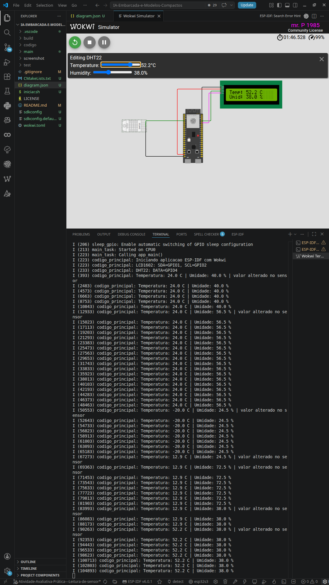

# IA Embarcada e Modelos Compactos

Projeto da disciplina de IA Embarcada — leitura de sensor DHT22 com ESP32-S3 e exibição no LCD1602, tudo rodando no simulador Wokwi com ESP-IDF.



## O que faz

A aplicação lê temperatura e umidade do DHT22 a cada 2 segundos, mostra os valores no display LCD1602 (via I2C) e também imprime no monitor serial.

Componentes usados:
- **ESP32-S3 DevKitC-1** — controlador
- **DHT22** — sensor de temperatura e umidade
- **LCD1602 I2C** — display para mostrar as leituras

## Circuito

| Componente | Sinal | Pino no ESP32-S3 |
|:---|:---:|:---:|
| LCD1602 | SDA | GPIO 1 |
| LCD1602 | SCL | GPIO 2 |
| LCD1602 | VCC | 5V |
| LCD1602 | GND | GND |
| DHT22 | Dados | GPIO 4 |
| DHT22 | VCC | 3V3 |
| DHT22 | GND | GND |

## Como rodar

Precisa ter o VS Code com as extensões ESP-IDF e Wokwi Simulator instaladas, além de uma conta ativa no Wokwi.

```bash
./iniciar.sh
```

Vai abrir um menu em modo texto com estas opções:

- `1` compilar usando build incremental
- `2` limpar tudo e compilar do zero
- `3` limpar tudo, compilar do zero e abrir o diagrama no VS Code
- `4` abrir o projeto e o `diagram.json` no VS Code
- `0` sair

O script compila o firmware. Para rodar a simulação dentro do VS Code, abra a paleta de comandos com `Ctrl+Shift+P` e execute `Wokwi: Start Simulator`.

No monitor serial deve aparecer algo assim:

```
Temperatura: 56.4 C | Umidade: 66.0 %
```

Dá pra mexer nos valores do DHT22 direto no Wokwi e ver atualizando no LCD e no serial.

## Arquivos principais

- `main/main.c` — inicializa tudo e roda o loop de leitura
- `main/dht22.c` / `main/dht22.h` — driver do sensor DHT22
- `main/lcd1602_i2c.c` / `main/lcd1602_i2c.h` — driver do LCD por I2C
- `diagram.json` — circuito do Wokwi
- `wokwi.toml` — config do simulador

## Licença

MIT — ver arquivo `LICENSE`.
